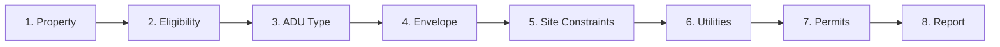
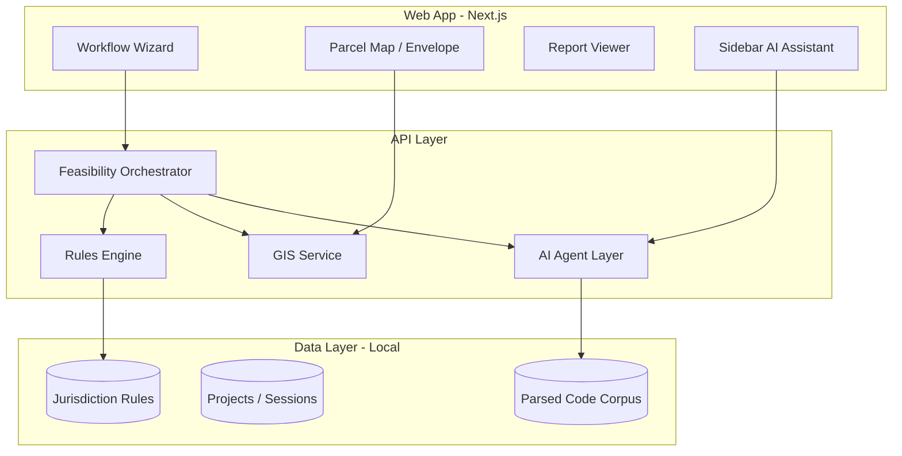

# ADU Feasibility Web App — Build Plan

> Living build plan for the Burbank-first ADU feasibility workflow. Updated by the agent per `agent.md`.

**Last updated:** 2026-06-26  
**Current phase:** Phase 0 — Foundation (not started)  
**Overall status:** 🟡 Planning complete, implementation not started

---

## Product Summary

**One-line:** A guided feasibility workflow that takes an address, pulls parcel/zoning data, runs Burbank ADU rules against the user's project intent, and produces a decision-grade feasibility report with cited requirements and permit roadmap.

**Primary users:** Builders, designers, and permit expeditors doing pre-construction screening (builder-facing tone and detail level).

**Jurisdiction scope:** Burbank, CA first — expandable via jurisdiction plugin model.

---

## Locked Product Decisions

| Decision | Choice | Notes |
|----------|--------|-------|
| Auth | Anonymous session | No login required for v1; session stored locally |
| Audience | Builder-facing | Technical detail, permit strategy, risk framing |
| AI UX | Sidebar assistant | Context-aware chat during wizard; not report-only |
| Data posture | Local-first | Projects, findings, and reports stay on-device; no required cloud sync |

---

## Non-Goals (v1)

- Guaranteed approval or substitute for official zoning letter
- Full architectural design or structural engineering
- Automated plan submittal to ProjectDox

---

## User Workflow (8 Steps)



1. **Property intake** — address/APN → parcel, zone, overlays
2. **Eligibility screen** — allowed zones, JADU rules, count limits, ministerial path
3. **ADU type selection** — detached, attached, garage conversion, ADU-on-garage, JADU
4. **Development envelope** — setbacks, max size, height, parking, map placement
5. **Site constraints** — fire zone, R-1-H, trees, historic, unpermitted work attestation
6. **Utilities** — BWP electric/water, sewer, school fees
7. **Permit pathway** — planning pre-app, ProjectDox, department reviews, BPAP option
8. **Feasibility report** — PDF/Markdown export with cited findings

---

## Architecture



**Core principle:** Deterministic rules engine is source of truth for pass/fail and numeric limits. LLM parses source documents, explains findings, and handles ambiguous edge cases — never silently overrides numbers.

---

## Tech Stack

| Layer | Choice |
|-------|--------|
| Frontend | Next.js 15 (App Router) + TypeScript |
| UI | Tailwind + shadcn/ui |
| Map | MapLibre GL |
| Backend | Next.js API routes |
| Local DB | SQLite + better-sqlite3 or IndexedDB (local-first sessions) |
| Rules | JSON/YAML + TypeScript evaluator |
| AI | Vercel AI SDK (streaming sidebar chat) |
| PDF export | React-PDF or Puppeteer |

> Stack may shift for local-first storage; update this table when chosen.

---

## Target Directory Structure

```
adu-feasibility/
├── plan.md                          # This file
├── agent.md                         # Agent instructions
├── package.json
├── src/
│   ├── app/                         # Next.js routes
│   │   ├── page.tsx                 # Landing
│   │   └── feasibility/
│   │       ├── new/page.tsx
│   │       ├── [id]/page.tsx        # Wizard shell
│   │       └── [id]/report/page.tsx
│   ├── components/
│   │   ├── wizard/                  # Step components
│   │   ├── map/                     # Envelope map
│   │   ├── findings/                # Live findings feed
│   │   └── chat/                    # Sidebar assistant
│   ├── lib/
│   │   ├── rules/                   # Rules evaluator
│   │   ├── gis/                     # Parcel lookup
│   │   ├── storage/                 # Local session persistence
│   │   └── report/                  # PDF/Markdown export
│   └── plugins/
│       └── burbank-ca/              # Burbank jurisdiction plugin
│           ├── rules/               # Rule YAML/JSON
│           ├── permit-templates/
│           └── index.ts             # JurisdictionPlugin impl
├── data/
│   └── burbank/                     # Parsed handouts, code chunks (RAG)
└── tests/
    └── rules/                       # Golden cases + unit tests
```

---

## Burbank Rules Corpus (v1)

Primary sources:

- BMC § 10-1-620.3 (ADU standards)
- ADU Handout (7/11/2024)
- ADU FAQ Sheet
- Building permit ADU page + BPAP docs
- BWP Electric/Water ADU forms
- CA Gov. Code § 65852.2 (state preemption overlay)

Rule categories: permitted zones, count limits, max size, setbacks, height, parking, JADU, FAR/lot coverage, design review, review timeline.

---

## Implementation Phases

### Phase 0 — Foundation ⬜ Not started

- [ ] Next.js scaffold + TypeScript + Tailwind + shadcn/ui
- [ ] Jurisdiction plugin interface (`JurisdictionPlugin`)
- [ ] Burbank rule schema + 10–15 core rules manually encoded
- [ ] Static wizard UI (steps 1–3) with manual zone entry
- [ ] Local session storage (anonymous)
- [ ] `plan.md` + `agent.md` in repo

### Phase 1 — Burbank MVP ⬜

- [ ] Full Burbank rule set (~40–60 rules)
- [ ] Address → parcel lookup (best available GIS)
- [ ] Eligibility + size + setback + parking + height evaluators
- [ ] Permit roadmap generator
- [ ] PDF feasibility report
- [ ] Sidebar AI chat scoped to findings (RAG over handouts)

### Phase 2 — Site Envelope ⬜

- [ ] Interactive MapLibre map + ADU footprint placement
- [ ] Setback violation detection
- [ ] Building separation checks

### Phase 3 — Ingestion Pipeline ⬜

- [ ] PDF upload → parse → admin review → publish
- [ ] Rule versioning + effective dates
- [ ] Change detection when city updates docs

### Phase 4 — Polish & Expand ⬜

- [ ] BPAP path recommendation
- [ ] Fee calculator from published schedules
- [ ] Second jurisdiction plugin (validate plugin model)

---

## First Build Slice (Recommended Start)

1. Manual Burbank rules JSON (~20 rules: eligibility, size, setbacks, parking, height)
2. Wizard steps 1–3 + 7–8 (manual property entry → type → permits → report)
3. Rules evaluator with live findings feed
4. PDF report export

Then add GIS, map envelope, and sidebar AI chat.

---

## v1 Success Criteria

- [ ] Burbank address → eligibility verdict in < 60 seconds
- [ ] Report includes ≥ 25 cited requirements
- [ ] ≥ 90% accuracy on numeric standards vs official handout (golden tests)
- [ ] Permit roadmap matches city published ADU / plan check process
- [ ] Architecture supports adding a second city via one plugin + rules file

---

## Open Decisions

_None — product decisions locked (anonymous, builder-facing, sidebar assistant, local-first)._

---

## Risks

| Risk | Mitigation |
|------|------------|
| GIS data incomplete for Burbank | Manual fallback + confidence flags |
| BMC amendments | Versioned rules + ingestion pipeline |
| "Physically infeasible" is discretionary | Surface as planner determination; never auto-approve |
| User treats app as permit approval | Prominent disclaimer + "verify with Planning" CTAs |
| LLM overrides numeric rules | Rules engine is sole source of truth |

---

## Changelog

| Date | Change |
|------|--------|
| 2026-06-26 | Initial plan created from feasibility design session. Decisions locked: anonymous, builder-facing, sidebar assistant, local-first. |
