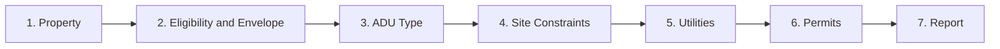
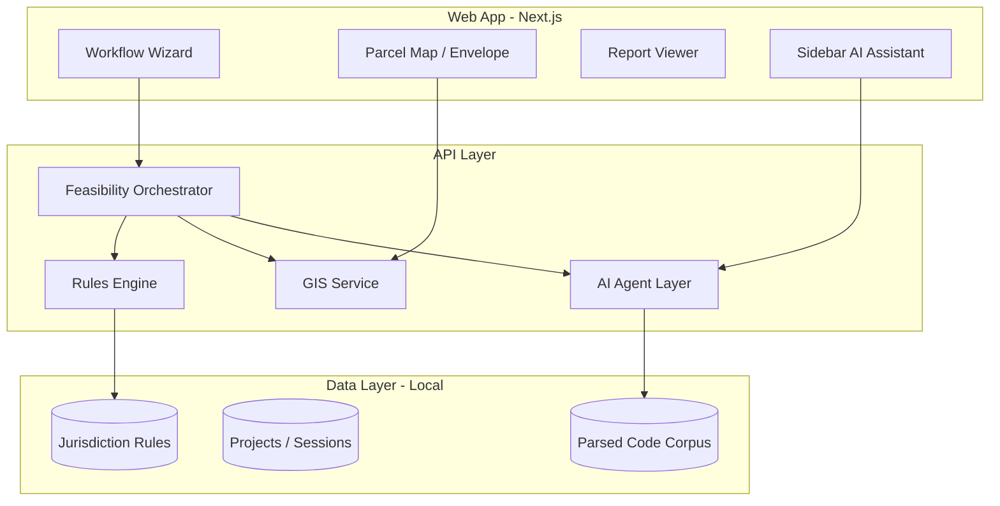

# ADU Feasibility Web App — Build Plan

> Living build plan for the Burbank-first ADU feasibility workflow. Updated by the agent per `agent.md`.

**Last updated:** 2026-06-28  
**Current phase:** Phase 1 — Burbank MVP (in progress)  
**Overall status:** 🟢 Foundation shipped; app shell + horizontal stepper UX shipped

---

## Product Summary

**One-line:** A guided feasibility workflow that takes an address, pulls parcel/zoning data, runs Burbank ADU rules against the user's project intent, and produces a decision-grade feasibility report with cited requirements and permit roadmap.

**Primary users:** Builders, designers, and permit expeditors doing pre-construction screening (builder-facing tone and detail level).

**Jurisdiction scope:** Burbank, CA first — expandable via jurisdiction plugin model.

---

## Locked Product Decisions

| Decision | Choice | Notes |
|----------|--------|-------|
| Auth | Anonymous session | No login required for v1; session stored locally |
| Audience | Builder-facing | Technical detail, permit strategy, risk framing |
| AI UX | Sidebar assistant | Context-aware chat during wizard; not report-only |
| Data posture | Local-first | Projects, findings, and reports stay on-device; no required cloud sync |

---

## Non-Goals (v1)

- Guaranteed approval or substitute for official zoning letter
- Full architectural design or structural engineering
- Automated plan submittal to ProjectDox

---

## User Workflow (7 Steps)



1. **Property intake** — single search field (street address **or** APN); GIS lookup fills parcel data; read-only confirmation after lookup
2. **Eligibility & envelope** — GC overview (parcel facts, jurisdiction, eligibility, proposed size/height, measured site plan); site map; ADU placement; floor area capacity; development requirements list; zone override in collapsible details
3. **ADU type selection** — detached, attached, garage conversion, ADU-on-garage, JADU
4. **Site constraints** — auto-detected site screening (fire, transit, slope, permit parking, historic, trees, structure discrepancy); manual confirm only for curb cut and GIS gaps
5. **Utilities** — BWP electric/water, sewer, school fees
6. **Permit pathway** — planning pre-app, ProjectDox, department reviews, BPAP option
7. **Feasibility report** — PDF/Markdown export with cited findings

---

## Architecture



**Core principle:** Deterministic rules engine is source of truth for pass/fail and numeric limits. LLM parses source documents, explains findings, and handles ambiguous edge cases — never silently overrides numbers.

---

## Tech Stack

| Layer | Choice |
|-------|--------|
| Frontend | Next.js 16 (App Router) + TypeScript |
| UI | Tailwind + custom form components |
| Map | MapLibre GL |
| Backend | Client-side GIS fetch (no API routes yet) |
| Local DB | IndexedDB via idb-keyval (local-first sessions) |
| Rules | JSON/YAML + TypeScript evaluator |
| AI | Vercel AI SDK (streaming sidebar chat) |
| PDF export | React-PDF or Puppeteer |

> Stack may shift for local-first storage; update this table when chosen.

---

## Target Directory Structure

```
adu-feasibility/
├── plan.md                          # This file
├── agent.md                         # Agent instructions
├── package.json
├── src/
│   ├── app/                         # Next.js routes
│   │   ├── page.tsx                 # Landing
│   │   └── feasibility/
│   │       ├── new/page.tsx
│   │       ├── [id]/page.tsx        # Wizard shell
│   │       └── [id]/report/page.tsx
│   ├── components/
│   │   ├── layout/                  # AppShell (Projects-only sidebar)
│   │   ├── feasibility/             # Wizard shell, steps, projects dashboard
│   │   │   └── steps/
│   │   │       ├── StepProperty.tsx
│   │   │       ├── StepEligibilityEnvelope.tsx
│   │   │       └── …
│   │   ├── map/                     # SiteEnvelopeMap (buildable zone layer)
│   │   └── ui/                      # Form, CollapsiblePanel
│   ├── lib/
│   │   ├── rules/
│   │   │   ├── engine.ts
│   │   │   ├── envelope-requirements.ts
│   │   │   ├── adu-floor-area.ts
│   │   │   └── site-requirements.ts
│   │   ├── property/
│   │   │   └── sync-from-site-plan.ts
│   │   ├── gis/
│   │   │   ├── burbank-lookup.ts
│   │   │   ├── burbank-overlays.ts
│   │   │   ├── site-screening.ts
│   │   │   ├── parking-streets.ts
│   │   │   ├── curb-cut-inference.ts
│   │   │   ├── buildings.ts
│   │   │   └── parse-property-search.ts
│   │   ├── geometry/site-plan.ts    # buildNetBuildableZone, computeMaxAduFootprint
│   │   └── storage.ts               # migrateWizardStep on load
│   └── plugins/
│       └── burbank-ca/              # Burbank jurisdiction plugin
│           ├── rules/               # Rule YAML/JSON
│           ├── permit-templates/
│           └── index.ts             # JurisdictionPlugin impl
├── data/
│   └── burbank/                     # Parsed handouts, code chunks (RAG)
└── tests/
    └── rules/                       # Golden cases + unit tests
```

---

## Burbank Rules Corpus (v1)

Primary sources:

- BMC § 10-1-620.3 (ADU standards)
- ADU Handout (7/11/2024)
- ADU FAQ Sheet
- Building permit ADU page + BPAP docs
- BWP Electric/Water ADU forms
- CA Gov. Code § 65852.2 (state preemption overlay)

Rule categories: permitted zones, count limits, max size, setbacks, height, parking, JADU, FAR/lot coverage, design review, review timeline.

---

## GIS Data Sources (implemented)

| Data | Source | Module |
|------|--------|--------|
| Geocoding | OpenStreetMap Nominatim | `src/lib/gis/geocode.ts` |
| Parcel geometry & attributes | LA County Assessor (`LACounty_Parcel`) | `src/lib/gis/parcel.ts` |
| Building footprints | LA County LARIAC 2023 (`GISNET_Public/434`) | `src/lib/gis/buildings.ts` |
| Zoning district | SCAG LDX `Zoning_poly_LA` (`ZN24_CITY`) | `src/lib/gis/zoning.ts` |
| Fire hazard / Mountain Fire screening | LA County Hazards FHSZ | `src/lib/gis/burbank-overlays.ts` |
| Steep slope / geotechnical screening | LA County LARIAC 10' contours (+ HMA fallback) | `src/lib/gis/burbank-overlays.ts` |
| Residential permit parking (Zones A–H) | City zone map street list (screening) | `src/lib/gis/parking-streets.ts` |
| Historic resources | LA County GISNET Historic Resources (331) | `src/lib/gis/site-screening.ts` |
| Street trees + canopy | LA County DPW trees + LARIAC7 canopy raster | `src/lib/gis/site-screening.ts` |
| Unpermitted structure risk | LARIAC footprints vs Assessor improved area | `src/lib/gis/site-screening.ts` |
| Curb cut inference | ADU type + garage footprint heuristic | `src/lib/gis/curb-cut-inference.ts` |
| Transit proximity (parking / height) | Static Burbank Metro + Metrolink anchors | `src/lib/gis/burbank-overlays.ts` |
| Orchestration | Parcel + zoning + overlays merge | `src/lib/gis/burbank-lookup.ts` |

**Zoning lookup flow:** APN match first (`APN24`), then point-in-polygon at parcel centroid. GIS codes mapped to app zones (`R-2` → `R2`, etc.); commercial/mixed-use → `OTHER` with manual override. `R-1-H` auto-sets hillside overlay flag.

**Confidence:** Zoning is `inferred` from SCAG (may lag city ordinance). User can override zone dropdown; non-residential districts prompt Planning verification. Slope is `inferred` from LARIAC 10' contour elevation range across the parcel (≥25% threshold). Permit parking uses street-name match against the City zone map (block-level signs govern). Historic screening uses LA County GISNET; tree screening uses county street-tree inventory and LARIAC canopy raster. Structure discrepancy compares LARIAC footprint area to Assessor improved sqft — screening only, not permit verification.

---

## Implementation Phases

### Phase 0 — Foundation ✅ Complete

- [x] Next.js scaffold + TypeScript + Tailwind
- [ ] Jurisdiction plugin interface (`JurisdictionPlugin`) — rules live in `src/lib/rules/engine.ts` for now
- [x] Burbank core rules encoded in TypeScript evaluator
- [x] Full 7-step wizard UI (property through report)
- [x] Local session storage (anonymous, IndexedDB)
- [x] `plan.md` + `agent.md` in repo

### Phase 1 — Burbank MVP 🟡 In progress

- [ ] Full Burbank rule set (~40–60 rules) — core evaluators shipped, not exhaustive
- [x] Address → parcel lookup (LA County Assessor)
- [x] Auto zoning lookup (SCAG LDX) with manual fallback
- [x] Eligibility + size + setback + parking + height evaluators
- [x] Permit roadmap generator
- [ ] PDF feasibility report — Markdown export only today
- [x] Sidebar assistant (local rule-based chat; RAG not wired)
- [x] **UX refactor:** 7-step wizard, single property search, combined eligibility/envelope
- [x] **App shell UX:** Projects-only left sidebar; projects dashboard; horizontal step stepper on project pages; Live Findings panel removed (Code Assistant retained)

### Phase 2 — Site Envelope 🟡 Partial

- [x] Interactive MapLibre map + ADU footprint placement
- [x] Setback violation detection (rules + map analysis)
- [x] Building separation checks — 5' buffer in buildable zone; primary + garage separation on placed ADU

### Phase 3 — Ingestion Pipeline ⬜

- [ ] PDF upload → parse → admin review → publish
- [ ] Rule versioning + effective dates
- [ ] Change detection when city updates docs

### Phase 4 — Polish & Expand ⬜

- [ ] BPAP path recommendation
- [ ] Fee calculator from published schedules
- [ ] Second jurisdiction plugin (validate plugin model)

---

## First Build Slice (Recommended Start)

1. ~~Manual Burbank rules JSON (~20 rules: eligibility, size, setbacks, parking, height)~~ → shipped in `engine.ts`
2. ~~Wizard steps 1–8~~ → shipped
3. ~~Rules evaluator with live findings feed~~ → shipped
4. PDF report export — **remaining**
5. ~~GIS parcel + zoning lookup~~ → shipped (Assessor + SCAG)
6. ~~Map envelope + sidebar assistant~~ → shipped (v1)

**Next slice:** PDF export, jurisdiction plugin extraction, golden rule tests, overlay GIS (fire zone, historic).

---

## v1 Success Criteria

- [ ] Burbank address → eligibility verdict in < 60 seconds
- [ ] Report includes ≥ 25 cited requirements
- [ ] ≥ 90% accuracy on numeric standards vs official handout (golden tests)
- [ ] Permit roadmap matches city published ADU / plan check process
- [ ] Architecture supports adding a second city via one plugin + rules file

---

## UX Refactor — Wizard Simplification ✅ Shipped (2026-06-27)

### Shipped

- [x] Property step: single address/APN search (`parse-property-search.ts`); GIS confirmation card; overlays/conditions moved to Site Constraints
- [x] Step 2 `eligibility_envelope`: parcel facts, eligibility findings, `EnvelopeRequirementsList`, buildable zone on map, ADU placement, zone override
- [x] `envelope-requirements.ts` — shared setback/height/size limits for list + map inset
- [x] `migrateWizardStep` — legacy `eligibility` / `envelope` → `eligibility_envelope` on load

### App shell + horizontal stepper ✅ Shipped (2026-06-28)

- [x] `AppShell` — persistent left sidebar with **Projects** only (`src/components/layout/AppShell.tsx`)
- [x] `ProjectsDashboard` — New project CTA + local project list at `/`
- [x] Horizontal `StepNav` stepper atop each `/feasibility/[id]` page (Property → Report)
- [x] Live Findings side panel removed; Code Assistant collapsible panel retained (`assistant-open:{projectId}`)

### Reference (design notes)

**Property step removed:** separate address/APN fields, zone dropdown, lot metrics, front setback, existing conditions, overlays.

**Step 2 layout:** compact GC overview (single card: site facts, eligibility, measured setbacks/buildable, proposed inputs) → site map → ADU placement → floor area capacity → development requirements.

**Navigation:** global sidebar = Projects; workflow steps = horizontal stepper on project pages.

---

## Risks

| Risk | Mitigation |
|------|------------|
| GIS data incomplete for Burbank | SCAG zoning + Assessor parcels; manual zone override + `OTHER` for non-residential; confidence flags on inferred data |
| BMC amendments | Versioned rules + ingestion pipeline |
| "Physically infeasible" is discretionary | Surface as planner determination; never auto-approve |
| User treats app as permit approval | Prominent disclaimer + "verify with Planning" CTAs |
| LLM overrides numeric rules | Rules engine is sole source of truth |

---

## Changelog

| Date | Change |
|------|--------|
| 2026-06-28 | Step 2 UI trim: removed page header, remaining buildable, proposed height, zone override; proposed ADU area moved to placement; Live checks collapsed by default. |
| 2026-06-28 | Step 2 overview consolidated into one compact GC card: merged parcel/jurisdiction/eligibility modules, dropped duplicate ministerial + code citations, combined lot dimensions, trimmed measured-site fields. |
| 2026-06-28 | Step 2 hierarchy: GC overview first (parcel facts, jurisdiction, eligibility, proposed size/height, measured site plan), then site map → ADU placement → floor area capacity → development requirements. |
| 2026-06-28 | App shell UX: Projects-only left sidebar (`AppShell`), projects dashboard with New project + list, horizontal step stepper on project pages, Live Findings panel removed (findings still computed; Code Assistant retained). |
| 2026-06-27 | Floor area analyzer: `adu-floor-area.ts` computes single- vs two-story site max sq ft from ADU height limits (9' floor-to-floor / 7.5' CBC ceiling heuristic), map footprint solver, and code max; live findings + Eligibility step “Floor area capacity” card; notes when only one story is height-permitted (e.g. detached 12'/17'). |
| 2026-06-27 | Site GIS screening expanded: permit parking street match (Zones A–H), LA County historic resources, street-tree + LARIAC canopy proximity, LARIAC vs Assessor unpermitted-structure risk flag; curb-cut hint from ADU type + garage footprint; Site step manual panel shrinks when GIS detects conditions. |
| 2026-06-27 | Auto steep-slope screening on parcel lookup: LA County LARIAC 10' contours intersect parcel polygon; estimated max slope ≥25% sets `steepSlopeDetected` overlay; site requirements + live findings surface geotech trigger; HMA layer queried as unincorporated fallback. |
| 2026-06-27 | Site step: predefined Burbank site requirements (`site-requirements.ts`) auto-populated from GIS (fire hazard, transit, structure footprints); `SiteRequirementsList` + expanded Site live findings; manual toggles reduced to GIS-unknown confirmations only; property flags sync from site plan on every recompute. |
| 2026-06-27 | Fix live setback checks: measure side/rear/front from ADU local bounds using the same axis-aligned lot frame as buildSetbackEnvelopePolygon and max footprint placement — eliminates false side-setback fails when max ADU is shown on map. |
| 2026-06-27 | Buildable zone map layer shows continuous setback envelope minus structure footprints only; 5' separation and egress (3' side passage) constrain max ADU footprint sizing, not yellow zone geometry. |
| 2026-06-27 | Envelope geometry respects 5' structure separation buffer, garage separation checks, side access/egress warnings, and buildable-area consumption metrics on map + findings. |
| 2026-06-27 | ADU placement constrained to max footprint: sliders and updates clamp width, depth, and position inside computed max ADU zone; initial parcel lookup centers ADU in max footprint. |
| 2026-06-27 | Net buildable zone: setback envelope clipped to parcel and minus existing structure footprints; map highlights max ADU footprint within open buildable area (capped by code max size). |
| 2026-06-27 | Site map accuracy: primary/garage footprints from LA County LARIAC building outlines on parcel lookup; ADU default placement searches rear buildable zone away from existing structures. |
| 2026-06-27 | Fix site map overlay alignment: `orientParcel` now sets +Y into lot (not along front edge) and normalizes origin to front-left so buildable zone, primary, garage, and ADU render inside the parcel. |
| 2026-06-27 | UX refactor shipped: 7-step wizard (`eligibility_envelope`), single property search, `EnvelopeRequirementsList` + buildable zone map layer, `CollapsiblePanel` for findings/assistant, `migrateWizardStep` for saved sessions. |
| 2026-06-27 | Planned UX refactor: 7-step wizard (merge Eligibility + Envelope), single property search field, parcel facts on step 2, jurisdiction setback/height requirements on map + list, collapsible Code Assistant and Live Findings. |
| 2026-06-27 | Auto zoning lookup shipped: SCAG LDX `Zoning_poly_LA` via `src/lib/gis/zoning.ts`, integrated into parcel lookup. Plan status updated to Phase 1 in progress. |
| 2026-06-26 | Initial plan created from feasibility design session. Decisions locked: anonymous, builder-facing, sidebar assistant, local-first. |
